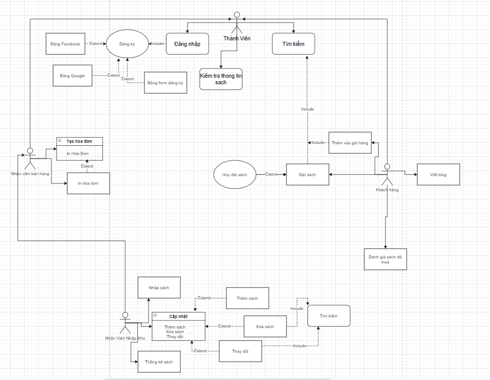
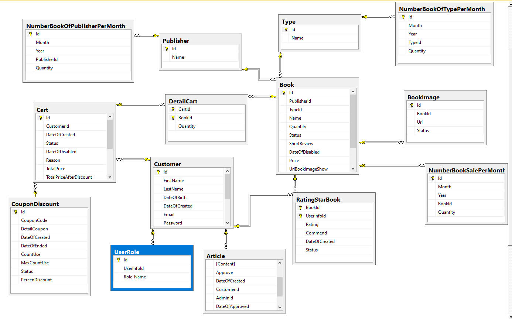

Link Asana: https://app.asana.com/0/1201162842743339/1201162842743339
# ProjectWeb-BookStore  
**Khách hàng:**  
1/ Đăng nhập, đăng ký bằng tài khoản ở website, gmail, facebook  
2/ Tìm kiếm các thông tin về sách  
3/ Tìm kiếm các bài blog  
4/ Xem đánh giá của người đã từng mua sách  
5/ Viết bài viết trên trang để nhận mã giảm giá  
6/ Mua sách  
7/ Đánh giá chất lượng sách sau khi mua  
----------------------------------------------------------------------------------------------------------------------------------------------------------------------------------
----------------------------------------------------------------------------------------------------------------------------------------------------------------------------------
**Admin** 
1/ Nhập sách mới 
2/ Cập nhật thông tin sách (thêm, sủa, xóa), số lượng sách 
3/ Thống kê sách 
4/ Cập nhật thông tin khách hàng 
5/ Tạo mã giảm giá, xác nhận đơn hàng 
6/ Quản lý bài viết do khách hàng viết 
7/ Tạo hóa đơn khách đã đặt sách 
8/ In hóa đơn 
9/ Quản lý review sách của khách hàng 
----------------------------------------------------------------------------------------------------------------------------------------------------------------------------------
**Usecase**  

----------------------------------------------------------------------------------------------------------------------------------------------------------------------------------
**Database**  

